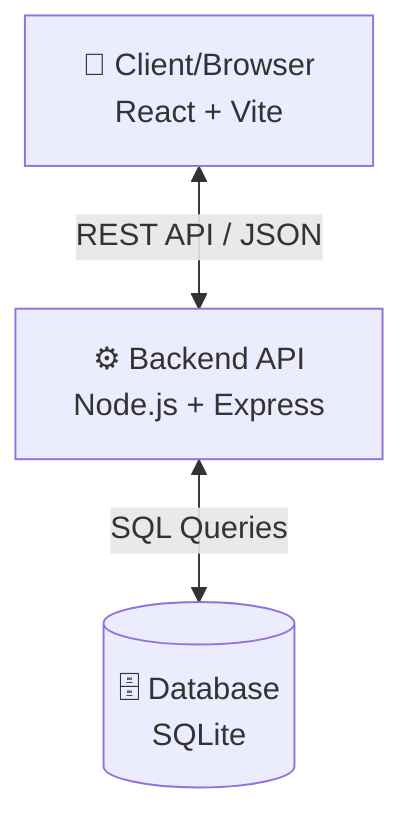
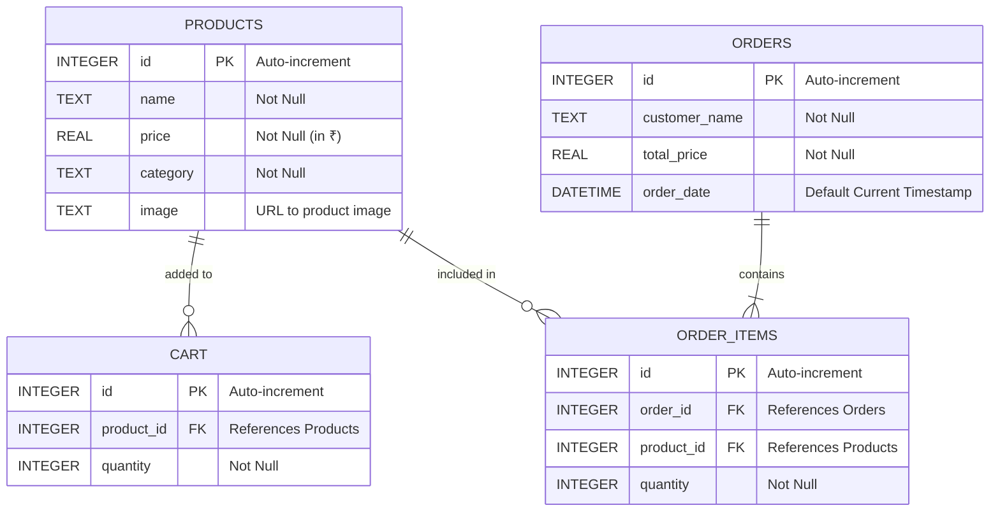

# 🛒 E-Commerce DBMS Platform


A full-stack, responsive E-commerce web application built for seamless online shopping and robust database management. Designed specifically as a Database Management System (DBMS) project, this platform demonstrates the practical integration of a relational database with a modern user interface.

## ✨ Features

- **🛍️ Complete Shopping Experience**: Browse products, view details, and seamlessly add items to your cart.
- **🔐 Admin Dashboard**: Monitor real-time orders, manage the product catalog, and view database statistics.
- **💳 Real-time Order Processing**: Simulated checkout that instantly updates the relational database records.
- **⚡ Fast & Modern UI**: Built with React and Vite for blazing-fast performance and a premium user experience.
- **📦 Pre-seeded Database**: Comes packed with realistic mock data (Laptops, Phones, Accessories) using the Indian Rupee (₹) currency.

---

## 🏗️ System Architecture

The project follows a standard **Client-Server Architecture** separating concerns between the presentation layer, application logic, and data persistence.



---

## 🗄️ Database Schema (ER Diagram)

The backbone of this application is a robust relational database built on SQLite. The schema is carefully normalized to manage products, user carts, and orders effectively.



---

## 🚀 Getting Started

Follow these steps to run the complete stack locally. Both frontend and backend servers will be launched simultaneously using a single command.

### Prerequisites
- [Node.js](https://nodejs.org/) (v16 or higher recommended)
- npm (Node Package Manager)

### Installation

1. **Clone the repository** (if you haven't already):
   ```bash
   git clone <repository-url>
   cd "DBMS project"
   ```

2. **Install all dependencies** (This installs root, frontend, and backend packages):
   ```bash
   npm run install:all
   ```

3. **Start the application**:
   ```bash
   npm start
   ```
   *This command uses `concurrently` to launch both the React frontend and the Express backend simultaneously.*

### Accessing the App
- **Frontend / Customer Shop**: `http://localhost:5173` (Default Vite port)
- **Backend API Server**: `http://localhost:5000` (Or configured backend port)

---

## 📂 Project Structure

```text
📦 DBMS project
 ┣ 📂 backend                 # Node.js + Express + SQLite Backend
 ┃ ┣ 📜 database.js           # Database initialization and schema queries
 ┃ ┣ 📜 server.js             # Express API endpoints and routing
 ┃ ┗ 📜 shopping.db           # Live SQLite Database file
 ┣ 📂 frontend                # React + Vite Frontend
 ┃ ┣ 📂 src                   # React Source Code
 ┃ ┃ ┣ 📂 components          # Reusable UI components (ProductCard, etc.)
 ┃ ┃ ┣ 📂 pages               # Main application views (Cart, Details, Admin)
 ┃ ┃ ┗ 📜 App.jsx             # Main Router and Layout
 ┃ ┗ 📜 package.json          # Frontend dependencies
 ┣ 📜 package.json            # Root configuration for running concurrent scripts
 ┗ 📜 README.md               # You are here!
```

---

## 🛠️ Tech Stack

### Frontend
- **React 19**: Component-based UI framework.
- **Vite**: Next-generation frontend tooling for ultra-fast builds.
- **React Router**: For seamless single-page application navigation.

### Backend
- **Node.js**: JavaScript runtime environment.
- **Express.js**: Fast, unopinionated, minimalist web framework.
- **SQLite3**: C-language library that implements a small, fast, self-contained, high-reliability, full-featured, SQL database engine.

---

## 📝 License

This project is licensed under the **ISC License**.
