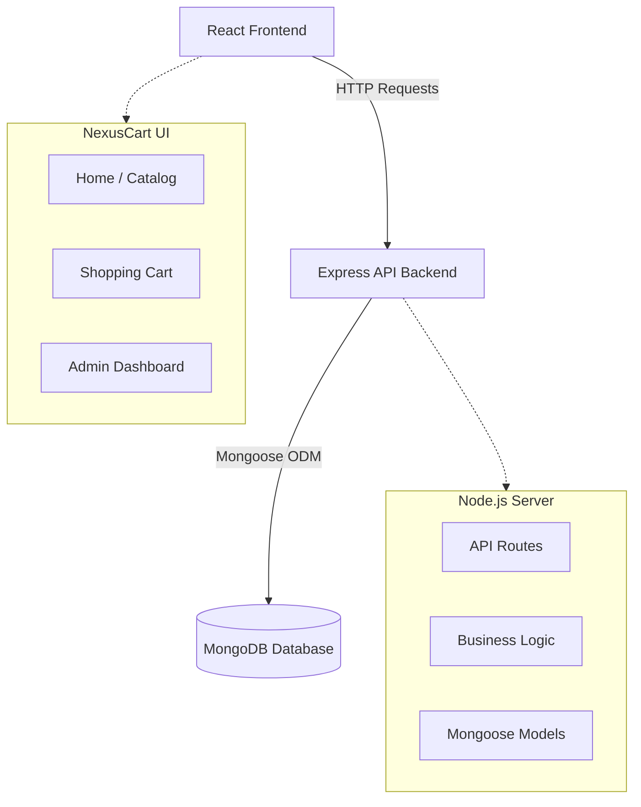
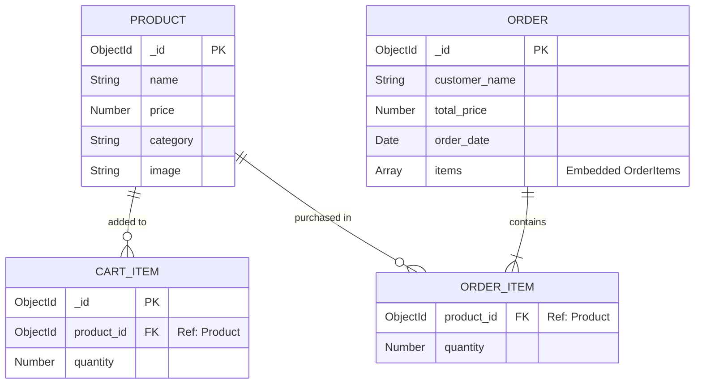

# NexusCart - E-Commerce DBMS Project

NexusCart is a premium, full-stack e-commerce web application built to demonstrate advanced Database Management System (DBMS) concepts using the MERN stack. It features a beautifully designed, responsive UI with glassmorphism aesthetics, real-time cart notifications, and a dedicated admin dashboard for comprehensive order and inventory management.

## 🌟 Key Features

- **Premium UI/UX:** Built with React, featuring dark-mode aesthetics, custom gradients, and smooth `react-hot-toast` notifications.
- **Dynamic Catalog:** Browse tech products, filter by category, and view detailed product specifications.
- **Cart & Checkout Flow:** Seamlessly add items to the cart and process simulated checkouts.
- **Admin Dashboard:** A dedicated interface to manage inventory (CRUD operations on products) and view detailed customer orders.
- **MERN Architecture:** Fully powered by MongoDB, Express, React, and Node.js.

---

## 🏗️ System Architecture

The application follows a standard client-server architecture, utilizing a RESTful API to communicate between the React frontend and the Express backend.



---

## 🗄️ Database Schema (MongoDB)

The project utilizes MongoDB as its primary database. The schema is designed using Mongoose for object data modeling, ensuring strict typing and relationship enforcement.



### Schema Details
- **Products:** Stores the master inventory of all electronics.
- **Cart:** Represents the active shopping session.
- **Orders:** When a user checks out, cart items are embedded into an Order document alongside the total price and customer name, providing an immutable historical record of the purchase.

---

## 🚀 Getting Started

### Prerequisites
- Node.js (v16 or higher)
- MongoDB (Running locally on `mongodb://localhost:27017` or via MongoDB Atlas)

### Installation

1. **Clone the repository**
   ```bash
   git clone https://github.com/Kushal-prime/DBMS-PROJECT.git
   cd DBMS-PROJECT
   ```

2. **Install dependencies**
   Install packages for both the backend and frontend simultaneously:
   ```bash
   npm run install:all
   ```

3. **Start the application**
   ```bash
   npm start
   ```
   *This command runs both the Node.js backend (port 5000) and the React frontend (port 5173) concurrently.*

> **Note on Database Seeding:**
> Upon first startup, the backend will detect if your MongoDB database is empty and will automatically populate it with default electronic products and realistic mock orders.

---

## 🛠️ Technology Stack

- **Frontend:** React.js, Vite, React Router DOM, React Hot Toast, Vanilla CSS
- **Backend:** Node.js, Express.js, Mongoose (ODM), Dotenv
- **Database:** MongoDB

---
*Developed for DBMS Course Project Demonstration.*
