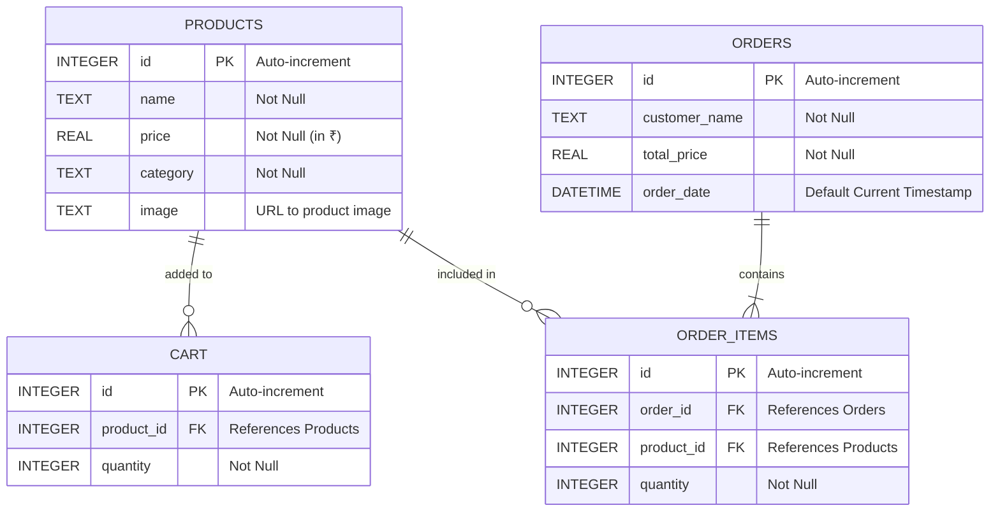

<div align="center">

# 🛒 E-Commerce DBMS Platform


A full-stack, responsive E-commerce web application built for seamless online shopping and robust database management. Designed specifically as a **Database Management System (DBMS)** project, this platform demonstrates the practical integration of a relational database with a modern user interface.

[Features](#-features) • [Architecture](#-system-architecture) • [Database](#-database-schema-erd) • [API Reference](#-api-endpoints) • [Getting Started](#-getting-started)

</div>

---

## ✨ Features

- **🛍️ Complete Shopping Experience**: Browse products, filter by category, view details, and seamlessly add items to your cart.
- **🔐 Admin Dashboard**: Monitor real-time orders, manage the product catalog (CRUD operations), and view database statistics.
- **💳 Real-time Order Processing**: Simulated checkout utilizing SQL transactions (`BEGIN`, `COMMIT`, `ROLLBACK`) that instantly update relational records.
- **⚡ Fast & Modern UI**: Built with React and Vite for blazing-fast performance, paired with a custom CSS design system.
- **📦 Pre-seeded Database**: Comes packed with realistic mock data (Laptops, Phones, Accessories) using the Indian Rupee (₹) currency.

---

## 🏗️ System Architecture

The project follows a standard **Client-Server Architecture**, maintaining a strict separation of concerns between the presentation layer, business logic, and data persistence.

```mermaid
graph TD
    subgraph Frontend "Client-Side (React + Vite)"
        UI[User Interface]
        State[React State / Context]
    end

    subgraph Backend "Server-Side (Node.js + Express)"
        Router[Express Router]
        Controllers[API Controllers]
    end

    subgraph Database "Data Layer (SQLite)"
        SQL[(SQLite db file)]
    end

    UI -->|User Action| State
    State <-->|HTTP REST / JSON| Router
    Router --> Controllers
    Controllers <-->|SQL Queries| SQL
```

---

## 🗄️ Database Schema (ERD)

The backbone of this application is a normalized relational database built on SQLite. The schema manages products, user carts, and orders using strict foreign key constraints.



---

## 🔌 API Endpoints

The Express backend exposes a comprehensive RESTful API for frontend integration.

| Method | Endpoint | Description |
| :--- | :--- | :--- |
| **GET** | `/products` | Fetch all products (supports `?category=` filter) |
| **GET** | `/products/:id` | Fetch a single product by ID |
| **POST** | `/products` | Create a new product (Admin) |
| **PUT** | `/products/:id` | Update an existing product (Admin) |
| **DELETE** | `/products/:id` | Delete a product (Admin) |
| **GET** | `/cart` | Fetch current user's cart items |
| **POST** | `/cart` | Add an item to the cart or update quantity |
| **DELETE** | `/cart/:id` | Remove an item from the cart |
| **POST** | `/checkout` | Process cart into an order (Uses SQL Transactions) |
| **GET** | `/orders` | Fetch all historical orders with nested items |
| **GET** | `/debug/db` | Retrieve raw JSON dump of all DB tables for DBMS review |

---

## 🚀 Getting Started

Follow these steps to run the complete stack locally. Both frontend and backend servers launch simultaneously using a single command.

### Prerequisites
- [Node.js](https://nodejs.org/) (v16 or higher)
- npm (Node Package Manager)

### Installation

1. **Clone the repository**:
   ```bash
   git clone https://github.com/Kushal-prime/DBMS-PROJECT.git
   cd "DBMS-PROJECT"
   ```

2. **Install all dependencies** (This installs root, frontend, and backend packages):
   ```bash
   npm run install:all
   ```

3. **Start the application**:
   ```bash
   npm start
   ```
   *This command leverages `concurrently` to launch both the React frontend and the Express backend simultaneously.*

### Accessing the App
- **Frontend / Customer Shop**: `http://localhost:5173`
- **Backend API Server**: `http://localhost:5000`

---

## 📂 Project Structure

```text
📦 DBMS project
 ┣ 📂 backend                 # Node.js + Express + SQLite Backend
 ┃ ┣ 📜 database.js           # Database initialization and schema queries
 ┃ ┣ 📜 server.js             # Express API endpoints and routing
 ┃ ┗ 📜 shopping.db           # Live SQLite Database file
 ┣ 📂 frontend                # React + Vite Frontend
 ┃ ┣ 📂 src                   # React Source Code
 ┃ ┃ ┣ 📂 components          # Reusable UI components (ProductCard, etc.)
 ┃ ┃ ┣ 📂 pages               # Main application views (Cart, Details, Admin)
 ┃ ┃ ┗ 📜 App.jsx             # Main Router and Layout
 ┃ ┗ 📜 package.json          # Frontend dependencies
 ┣ 📜 package.json            # Root configuration for running concurrent scripts
 ┗ 📜 README.md               # You are here!
```

---

<div align="center">
  <p>Built with ❤️ for Database Management Systems learning & practical application.</p>
</div>
